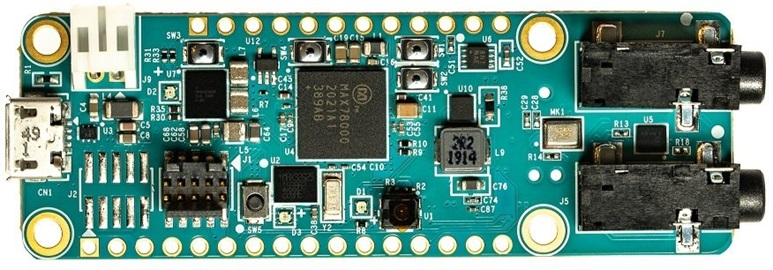

# Low Power Autonomous Face ID Application for MAX78000 running on RISC-V core

## Introduction

This project is a low power FaceID application built for MAX78000 Featherboard and using a ESP32 board. Using only RISC-V core, it runs a chage detection algorithm using a simple image comparing algorithm. When a change is detected, the CNN accelerator is activated and tries to identidy a subject registered in its database. Upon recognition, the raw image is send via UART to the ESP32 board, that proceeds to forward it using a UDP request. Finally, when a image is received, it is saved locally as a .png file and uploaded to a Google Firebase Storage databse.
This repository contains the MAX78000 project and, in tools folder, the ESP32 project and a simple python script to run an UDP server and retrieve the image.

## Requirements

### Hardware Requirements

The project uses MAX78000 series Dual-Core Ultra-Low-Power Microcontroller board. Our program is performed on [MAX78000_FTHR board](https://www.analog.com/media/en/technical-documentation/data-sheets/max78000fthr.pdf).

To upload the firmware for the first time use, you can follow the instructions [here](https://github.com/MaximIntegratedAI/MaximAI_Documentation/blob/master/MAX78000_Feather/README.md#first-time-firmware-updates).

Together with the FeatherBoard, there is an ESP32 DevKit V1 to provide wireless connectivity to the system. Since the boards have different logic levels (MAX78000 used 1.8V and ESP32 uses 2.3V), a logic level shifter is also required to communicate the boards.

### Software Requirements

The SDK for MAX78000 that can be found in this section: ["How to build, Flash and Debug the example"](#2-how-to-build-flash-and-debug-the-example).

The ESP32 code can be built, flashed and monitored using the esp-idf tool. Please refer to the [documentation](https://github.com/espressif/esp-idf).

Python3 installed in PC to support the image transfer and upload tool. Also, to send it to the database, it will be required the following libraries:
firebase>=3.0.1
firebase-admin>=6.0.1

Finally, to store the images in Firebase, create a application in that service. Please refer to [this website](https://cloud.google.com/firestore/docs/client/get-firebase?hl=pt-br).

## Project Layout  

    risc_v_img_capture
    ├─ .gitignore
    ├─ .project
    ├─ Makefile
    ├─ Makefile.ARM
    ├─ Makefile.RISCV
    ├─ README.md
    ├─ gdb.txt
    ├─ images
    │  └─ max78000fthr.jpg
    ├─ include
    │  ├─ MAXCAM_Debug.h
    │  ├─ cnn.h
    │  ├─ embedding_process.h
    │  ├─ embeddings.h
    │  ├─ esp32.h
    │  ├─ faceID.h
    │  ├─ flash_memory.h
    │  ├─ img_capture.h
    │  └─ weights.h
    ├─ main.c
    ├─ main_riscv.c
    ├─ risc_v_img_capture.launch
    ├─ src
    │  ├─ cnn.c
    │  ├─ embedding_process.c
    │  ├─ esp32.c
    │  ├─ faceID.c
    │  ├─ flash_memory.c
    │  └─ img_capture.c
    └─ tools
    ├─ esp_tool
    │  ├─ CMakeLists.txt
    │  ├─ main
    │  │  ├─ CMakeLists.txt
    │  │  ├─ main.c
    │  │  └─ max78000_cmds.h
    │  └─ sdkconfig
    └─ pc_tool
        ├─ imgConverter.py
        ├─ udp_terminal.py
        └─ upload.py

## Getting Started  

### 1.  Required Connections  

Connect a USB cable between the PC and the CN1 (USB/PWR) connector of the Feather Board.

The boards communicate via UART. Wire TX (UART2) pin P1_1 of the MAX78000_FTHR to RXD_2 pin 25 of the ESP32 Devkit V1. Also, it is necessary to wire the ground of the two boards.

### 2.  How to Build, Flash and Debug the MAX78000_FTHR

Please follow the instructions in [Getting Started with the MAX78000FTHR](https://github.com/MaximIntegratedAI/MaximAI_Documentation/blob/master/MAX78000_Feather/README.md#getting-started-with-the-max78000fthr)

If you are using Visual Studio Code as your platform, please follow the instructions  [here](.vscode/readme.md).

### 3.  How to Build, Flash and Debug the ESP32 board

Please follow the instructions in [Espressif IoT Development Framework]((https://github.com/espressif/esp-idf))

### 4. How to Get the Picture on PC and send to the cloud

To upload the picture to the cloud, first create a Firebase application, get it's SDK file (JSON) and put it in the /tools/pc_tool folder. After that, just change the name of the file and the firebase application link in upload.py

Run: sudo python udp_terminal.py

## Links to Powerpoint and Youtube Video (not up to date)

[PowerPoint](https://docs.google.com/presentation/d/1iDG8Hwt4incC3QIWbK0QsuGcLuzB3y-jmzu0u0kR7mA/edit?usp=sharing)  
[Video](https://youtu.be/qPhET3jG1A0)
[Report](./report/Embedded_Systems_Project_Report_XU_LIMA.pdf)
